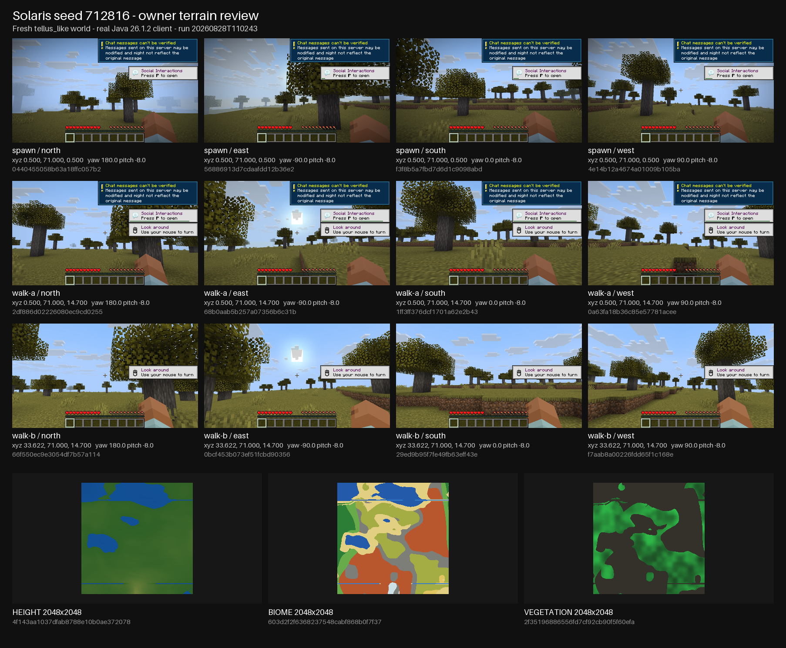

# Phase 4 seed 712816 owner disposition package — 2026-08-28

## Scope

This package collects the already-green automated and visual evidence for the only remaining Phase-4 item-1 boundary in `docs/PUBLIC_ALPHA_PLAN.md`: the owner's subjective terrain/playability disposition for a fresh `tellus_like` world on seed `712816`.

It does **not** turn agent observations into an owner verdict. The three remaining open checkboxes in the public-alpha plan all refer to this same disposition boundary.

## Automated gameplay already proved

The exact-seed real-client traversal/restart gate in [`phase4-seed-712816-restart-rejoin-2026-08-21.md`](phase4-seed-712816-restart-rejoin-2026-08-21.md) is PASS on a fresh world with no operators or debug setup. A real Minecraft Java 26.1.2 client:

- joined generated terrain;
- reached naturally generated acacia;
- broke and picked up three natural log drops;
- crafted twelve planks, a crafting table, sticks, and a wooden pickaxe;
- placed/opened the crafting table;
- stopped Solaris cleanly, restarted the same world, and rejoined;
- recovered the same position, wooden pickaxe, and placed restart marker.

The stronger 24,000-tick no-operator survival run in [`phase4-20-minute-survival-2026-08-26.md`](phase4-20-minute-survival-2026-08-26.md) is also PASS on seed `712816`: passive and hostile natural spawns were observed, three natural death/respawn/drop recoveries completed, and the final clean restart/rejoin preserved state. The soak's final client state was still in Play at approximately `(9.224, 70.0, -0.381)`.

Therefore the remaining question is not whether the seed functions as a survival world. It is whether the owner considers the generated terrain and local playability acceptable for this public-alpha target.

## Visual material

### One-glance owner contact sheet

The canonical review sheet combines the final twelve first-person views with the three checked-in 2048x2048 diagnostic mosaics:

- artifact: [`phase4-seed-712816-owner-review-contact-sheet.png`](phase4-seed-712816-owner-review-contact-sheet.png);
- dimensions: `1806x1490` RGB PNG;
- SHA-256: `e7b1a510b416069d330067575be93895991789028a742db8a12dc20b3dfb83c2`;
- renderer: `tools/render-seed-owner-review-contact-sheet.py`, invoked with the explicit successful run directory `.analysis/seed-owner-review/20260828T110243` rather than a latest/default run selector;
- every first-person tile is accepted by the renderer only after its source PNG SHA-256 matches `result.json`; each label carries the observed coordinate and camera pose from that same final run. The bottom row uses the checked-in production-sampler height, biome and vegetation mosaics with their own digests.

The sheet is presentation-only aggregation. It does not alter or regenerate terrain and does not create a new acceptance signal beyond the underlying artifacts. A detached independent Pi/Luna review returned **PASS with no findings** after verifying the explicit-run contract, all source hashes/observed labels, documented mosaic identities, canonical `1806x1490` / `e7b1a510b416069d330067575be93895991789028a742db8a12dc20b3dfb83c2` output, byte-identical rerender, and visual readability/order.

### Ground-level real-client views

| View | Artifact | SHA-256 | Neutral observation |
| --- | --- | --- | --- |
| traversal before restart | `.analysis/real-client-runs/20260821T130644Z-real-client-playable-loop-yQG8Og/screenshots/playable-03-save-restart-before.png` | `f31c9aa7d45a8a06d1aabdfd3850b3ba530b72c3933851cbdbef4a66ab7903d4` | dry grassland/savanna-like surface, scattered acacia, crafting table placed on ordinary terrain, no visible void/chunk hole |
| same traversal after restart | `.analysis/real-client-runs/20260821T130644Z-real-client-playable-loop-yQG8Og/screenshots/playable-03-save-restart-after.png` | `813f20a739e42ab040837207dc595917f2636b739593448d0aa6e232ce5a0d80` | same local terrain and placed table after server restart/rejoin |
| 20-minute survival | `.analysis/real-client-runs/20260825T235506Z-real-client-playable-loop-Bl9LAn/screenshots/playable-04-twenty-minute-survival-loop.png` | `d7ea54081c0f90ddda5274b5295cc854f85068f5563d1f7ef2699eb2ea43b307` | same broad dry biome, gentle local relief/terracing, scattered trees and a naturally observed passive animal |

These screenshots prove rendered and traversable local terrain. Their first-person coverage is intentionally limited and does not by itself show every large-scale feature visible in the diagnostic mosaics.

### Fresh multi-location owner-review capture

A dedicated evidence-only route now expands the first-person coverage without changing worldgen or granting operator/debug access. `tools/run-seed-owner-review.py` starts a fresh ignored world and a real Minecraft Java 26.1.2 MCP client, captures four horizontal camera headings at spawn, then uses only bounded ordinary `forward + sprint + jump` client input to reach two additional viewpoints. It records the actual observed endpoints rather than claiming predetermined coordinates.

Final artifact: `.analysis/seed-owner-review/20260828T110243`.

Fresh-world/runtime provenance:

- the configured world path did not exist before server start and `result.json` records `world_dir_preexisting=false`; Solaris created it before the ready gate and the result records `world_dir_created_by_server=true`;
- effective config SHA-256: `97820bc62a3ebdf21dfae5da36b1bd50c8310de7cbb4ff72e0b029443b54e4ee`;
- `seed = 712816`, `worldgen_mode = "tellus_like"`, `operators = []`, and `allow_local_dev_operators = false`;
- the evidence runner uses connection, observation, camera, exact-tick input/wait, screenshot, and disconnect controls only; its source contains no chat-command, teleport, debug-setup, operator, or hidden server-state path;
- all twelve screenshot files are PNGs, exist independently, and their recomputed SHA-256 values match `result.json`;
- the server log contains no matching panic, gameplay `ERROR`, `DestinationUnloaded`, or degraded-delivery signature. The client has the already-dispositioned Xvfb/OpenAL sound-device startup error; rendering, movement, screenshots, and the route itself still complete with `passed=true`.

The three captured positions are genuinely distinct:

| Capture point | Observed position | Distance from prior capture points |
| --- | --- | --- |
| `spawn` | `(0.500, 71.000, 0.500)` | baseline |
| `walk-a` | `(0.500, 71.000, 14.700)` | `14.200` blocks from spawn |
| `walk-b` | `(33.622, 71.000, 14.700)` | `33.122` from `walk-a`, `36.037` from spawn |

`walk-a` reached its endpoint in the first 100-tick ordinary movement pulse. At `walk-b`, the first requested heading was locally obstructed and moved only `3.200` blocks; the runner records that failed leg, turns to another bounded heading, and the second ordinary input leg reaches the final point. This is intentional evidence behavior: the capture reports where the real client actually went and cannot manufacture a successful location by assuming its requested route completed.

Each frame records its own post-settle observed position, yaw, pitch and digest. The first independent review of this checkpoint correctly found that the prior artifact stored requested camera angles rather than reading them back; the runner now records both requested and observed camera pose, and this fresh rerun verifies every observed yaw/pitch matches the requested heading within `0.01` degree:

| View | Artifact | SHA-256 | Position | observed yaw / pitch |
| --- | --- | --- | --- | --- |
| spawn / north | `.analysis/seed-owner-review/20260828T110243/screenshots/spawn-north.png` | `0440455058b63a18ffc057b27d15e97ba7070609e90b91b345fbe5b2f03b9bf8` | `(0.500, 71.000, 0.500)` | `180.0 / -8.0` |
| spawn / east | `.analysis/seed-owner-review/20260828T110243/screenshots/spawn-east.png` | `56886913d7cdaafdd12b36e2d1738f23c441f3270b65b858d3334f86d9006671` | `(0.500, 71.000, 0.500)` | `-90.0 / -8.0` |
| spawn / south | `.analysis/seed-owner-review/20260828T110243/screenshots/spawn-south.png` | `f3f8b5a7fbd7d6d1c9098abd822057fe19281982cf775f8cda687b2c86bb724c` | `(0.500, 71.000, 0.500)` | `0.0 / -8.0` |
| spawn / west | `.analysis/seed-owner-review/20260828T110243/screenshots/spawn-west.png` | `4e14b12a4674a01009b105bac3d08eb7d02cdf93504bdd1e706166a56cba98a1` | `(0.500, 71.000, 0.500)` | `90.0 / -8.0` |
| walk-a / north | `.analysis/seed-owner-review/20260828T110243/screenshots/walk-a-north.png` | `2df886d02226080ec9cd02550145bef502b099d3b42bac064528b7984bdf2441` | `(0.500, 71.000, 14.700)` | `180.0 / -8.0` |
| walk-a / east | `.analysis/seed-owner-review/20260828T110243/screenshots/walk-a-east.png` | `68b0aab5b257a07356b6c31b54b74e2eec5fd8be07d35747a56976581437f08b` | `(0.500, 71.000, 14.700)` | `-90.0 / -8.0` |
| walk-a / south | `.analysis/seed-owner-review/20260828T110243/screenshots/walk-a-south.png` | `1ff3ff376dcf1701a62e2b433f3978abcadec7e34ed0bb204c9c846d597392f0` | `(0.500, 71.000, 14.700)` | `0.0 / -8.0` |
| walk-a / west | `.analysis/seed-owner-review/20260828T110243/screenshots/walk-a-west.png` | `0a63fa18b36c85e57781acee79306ba840f054196c3fe6b049a5a4c434f1ac89` | `(0.500, 71.000, 14.700)` | `90.0 / -8.0` |
| walk-b / north | `.analysis/seed-owner-review/20260828T110243/screenshots/walk-b-north.png` | `66f550ec9e3054df7b57a1143476adf9b2255921a382edb23911abc3301df7ae` | `(33.622, 71.000, 14.700)` | `180.0 / -8.0` |
| walk-b / east | `.analysis/seed-owner-review/20260828T110243/screenshots/walk-b-east.png` | `0bcf453b073ef51fcbd90356d719858e321d3fc792ba35674e8f0a9d7df8c1b6` | `(33.622, 71.000, 14.700)` | `-90.0 / -8.0` |
| walk-b / south | `.analysis/seed-owner-review/20260828T110243/screenshots/walk-b-south.png` | `29ed9b95f7fe49fb63eff43eb559e06a8bd361ade821162ec1a0f1a9c2cde626` | `(33.622, 71.000, 14.700)` | `0.0 / -8.0` |
| walk-b / west | `.analysis/seed-owner-review/20260828T110243/screenshots/walk-b-west.png` | `f7aab8a00226fdd65f1c168e2d299e1f0131d888d66656aa8c3ec720d5737a35` | `(33.622, 71.000, 14.700)` | `90.0 / -8.0` |

The new frames remain neutral evidence, not a quality verdict. Representative views show continuous rendered dry grassland/savanna-like terrain, scattered trees, shallow local terraces/steps, and ordinary movement-space continuity across the three locations; the owner's preference about the relief, monotony, biome character, and overall terrain quality remains the acceptance criterion.

### Post-coherence-model rerun — 2026-08-30

The measured multi-scale climate-domain model and multi-seed family metrics were
completed before this fresh owner-review capture. The evidence-only route was
rerun against a newly created world with the same exact seed and no operators:

- artifact directory: `.analysis/seed-owner-review/20260830T204140`;
- `result.json` SHA-256:
  `537a531bdfc2c268b52638aad2f8e6c888e7f1773e6fb62fb54c605e770dcbd6`;
- `passed=true`, `seed=712816`, `operators=[]`,
  `world_dir_preexisting=false`, and
  `world_dir_created_by_server=true`;
- effective config SHA-256:
  `defcaeb113c81cceb130193bc244d8117f8192f6d4e5ec5eafc9a34b164d2a31`;
- observed positions were spawn `(0.500, 71.000, 0.500)`, walk-a
  `(0.500, 73.000, 31.125)`, and walk-b `(-34.911, 73.000, 31.125)`;
- the 12-frame contact sheet was rendered from that explicit run directory;
  SHA-256:
  `d3ac0c14bcc370a3fc25ecb83af9d586c29b0a5b95a1174a51990bb5251d9d8e`.

The first-person frames show continuous rendered plains/grassland and
snow-covered forest, trees, flowers, shallow relief and ordinary movement-space
continuity at all three observed locations. This is fresh agent-run evidence,
not an owner quality verdict; the owner must still explicitly accept or reject
the post-model terrain.

### Checked-in 2048x2048 diagnostic mosaics

The deterministic production sampler in [`worldgen-mosaics.md`](worldgen-mosaics.md) covers `x,z = [-1024,1024)` at 8 blocks/pixel:

- [`worldgen-mosaics/seed-712816/height.png`](worldgen-mosaics/seed-712816/height.png) — `861222d2a3fc634967e56af1f425feb998dce4687e03c31cf6e96ae47d089c4f`;
- [`worldgen-mosaics/seed-712816/biome.png`](worldgen-mosaics/seed-712816/biome.png) — `a5c3a964d9872c1454cb3fd120f6838be9d6f6de116dc7720914a27b2ce1f8ae`;
- [`worldgen-mosaics/seed-712816/vegetation.png`](worldgen-mosaics/seed-712816/vegetation.png) — `64c5235ec1229c01e2c4438686672e54ee4a0ddd36e5834771485dc25b01a17f`.

The mosaics factually show multiple land/water regions, multiple biome-family regions, spatially varying vegetation density, and the recorded long east-west river corridor. They are generated by the production sampler but remain diagnostic views rather than a substitute for first-person owner judgement.

## Validation and review

- final capture runner: exit `0` in detached tmux;
- final artifact `result.json`: `passed=true`, fresh-world fences true, three
  positions with pairwise horizontal separation `30.625`, `35.411`, and
  `46.817` blocks;
- all 12 screenshot files: valid PNG signatures and recomputed SHA-256 equal to
  `result.json`;
- all 12 post-settle camera observations: observed yaw/pitch equal the requested
  camera controls within `0.01` degree;
- `python3 -m py_compile tools/run-seed-owner-review.py`: PASS;
- prohibited evidence-route control scan (chat commands, debug/gamemode/time commands, teleport, `navigate_to_block`, block-scan/read authority): no match;
- `cargo run -p xtask -- code-health`: `0 fail / KEEP`.
- the post-model fresh run is recorded in
  `.analysis/seed-owner-review/20260830T204140/result.json`;
- the canonical seed mosaics were rerendered after the final model change and
  the complete rerender was byte-identical;
- focused worldgen tests, scoped clippy, formatter check, and code-health passed
  on the same tree.

The historical detached Pi/Luna closeout review of the 20260828 package
returned **CHANGES** with one High finding: the first capture artifact stored
requested camera yaw/pitch without copying the already available post-settle
client observation into `result.json`. The runner was corrected to store both
requested and observed camera pose, and the fresh-world capture was rerun as
`20260828T110243`. The current post-model run above uses the corrected schema.

## Owner decision boundary

The owner only needs to disposition the subjective row:

- **ACCEPT** — seed `712816` terrain/playability is acceptable for this alpha. Then close Phase 4 item 1 and the two duplicate seed-`712816` owner-disposition acceptance rows.
- **REJECT** — name the concrete terrain/playability defect visible or felt during review (for example relief scale, local monotony, biome transitions, river/coast form, spawn-area quality, or another specific issue). That defect becomes the next focused worldgen checkpoint; the automated traversal/restart evidence remains valid and is not discarded.

No additional implementation or automated evidence blocker remains for this
disposition. The extra multi-angle/multi-location real-client capture was
completed after the worldgen change. If the owner still wants wider visual
coverage before deciding, capture additional ordinary first-person locations on
the same seed; otherwise the next action is the explicit owner `ACCEPT` or
`REJECT` verdict.
